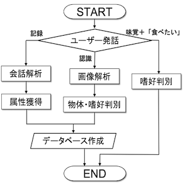

# RaspberryPi_robot
Development of brain-of-robot:Automatic recognition of the human preference by the interaction

# 概要
本研究ではRaspberryPiのRobovie-Zロボットの新しい機能として，ユーザーが日々の生活で食べる物を対象とし，物体認識および物体に対する味覚，好き嫌いなどの嗜好を判別するインタラクションシステムを提案する．本研究ではロボット上の音声アシスタントを作成し，会話の音声データからユーザーの嗜好と物体の情報を獲得して，ユーザー専用のデータベースを作成する．また，物体の識別器は，色情報と形状を特徴量とするRandom Forestを用いて構築する．

詳しい内容は　[卒業論文](Graduation_thesis.pdf)

# システム構図

